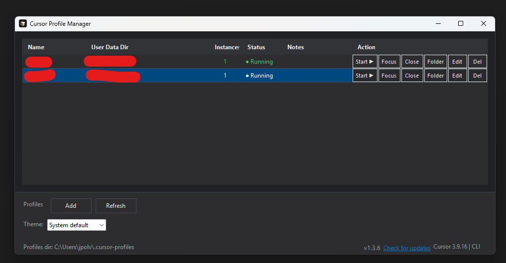
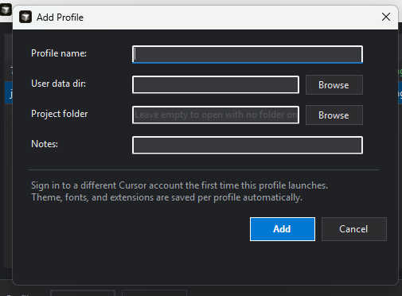
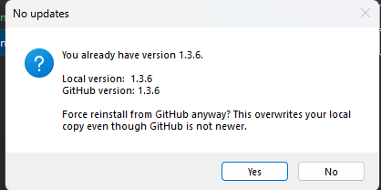

# Cursor Profile Manager

[](https://www.microsoft.com/windows)
[](https://github.com/PowerShell/PowerShell)
[](https://cursor.sh)
[](LICENSE)

A lightweight Windows GUI utility to manage and launch **multiple isolated Cursor IDE instances** on the same codebase. Each profile uses its own user-data directory, maintaining separate login sessions, extensions, settings, and AI chat history.

Version 2.0+ introduces native integration with **Agent Story**, a local MITM proxy and React dashboard to monitor, record, and inspect all Cursor AI requests, prompts, and streaming LLM payloads.

## Overview

Each profile gets its own folder under `%USERPROFILE%\.cursor-profiles\` (override with `CURSOR_PROFILES_DIR`). That lets several Cursor windows open the **same project** at once without sharing account credentials, extensions, or chat history.

The Profile Manager window title is built dynamically as **Cursor Profile Manager v*version*** so it is distinct from a Cursor IDE window editing this repo. **Multiple manager windows** may run at once — each launch opens a new instance.

## Screenshots

### Main window

Profile list with per-row **Actions** (Start, Focus, Close, Folder, Edit, Del), theme selector, and footer status (version, **Check for updates**, Cursor install info).



### Add Profile

Create a profile with a custom user-data directory, optional default project folder, and notes. Sign in to a different Cursor account the first time that profile launches.



### Check for updates

Footer **Check for updates** compares your local `# App-Version` marker with GitHub `master`. When versions match, you can still force reinstall from GitHub.



## Benefits

- **Multiple Cursors on one codebase** — parallel work in separate windows.
- **Separate accounts** — work vs. personal, or different clients (sign in once per profile).
- **Custom user-data dirs** — pick any folder per profile.
- **Parallel AI assistance** — independent agent/chat context per instance.
- **Multiple windows per profile** — start the same profile more than once when needed.

## Quick start

Clone this repository and run the PowerShell script:

```powershell
.\cursor-profile-manager.ps1
```

Or double-click `cursor-profile-manager.bat`.

**Desktop Shortcut** (launches with the Cursor icon, hiding the background console):
```powershell
.\install-desktop-shortcut.ps1
```

Re-run the shortcut installer if you move the folder to automatically repair the path.

## Features

| Feature | Description |
|:---|:---|
| **Isolated Profiles** | Add, edit, and delete profiles. Each profile runs with its own `--user-data-dir` (fully isolating extensions, themes, login sessions, and chat logs). |
| **Agent Story Integration (v2)** | Capture and inspect Cursor AI traffic (system prompts, user questions, tool calls, and streaming responses) with an embedded MITM proxy and React dashboard. |
| **Automatic Routing** | Proxied profiles automatically configure Chromium arguments, Node.js proxy environment variables, and `settings.json` HTTP proxy values. |
| **Project Context Mapping** | Writes a startup context marker (`cursor-profile-manager.context.json`) and registers the process PID with Agent Story to map TCP request sessions to the correct project workspace (avoids `Unassigned` telemetry). |
| **Live Process Tracking** | Monitors running instances using Windows WMI process start/exit events and a 2-second fallback timer. Shows live window count and active status in the grid. |
| **Parallel Execution** | Start multiple instances/windows for the same profile or run multiple different profiles concurrently on the same project folders. |
| **Theme Customization** | Light mode, Dark mode, or **System default** (dynamically tracks Windows color customization settings via registry changes). |
| **Tray and startup options** | Optional **Close/minimize to tray** sends the window to the notification area when you click minimize or close (X); tray menu **Show Window** / **Exit** (Exit confirms if Agent Story proxy is running). **Start with Windows** registers in the current-user Run key. |
| **In-App Auto-Updates** | One-click footer button comparing local code version markers against GitHub `master`. Updates all local script assets in-place on confirmation. |
| **Cursor Installer Helper** | Checks for Cursor installation path and CLI executable on `PATH`. Prompts to download and install if missing. |
| **Safe Deletion** | Prevents folder deletion if any window for the profile is still active. |

## Usage

1. **Launch the Manager:** Run `cursor-profile-manager.ps1` or use the Desktop shortcut.
2. **Add a Profile:** Click the **Add Profile** button in the toolbar. It automatically suggests isolated folders under `%USERPROFILE%\.cursor-profiles\`.
3. **Configure Defaults:** Optionally choose a default project directory (Cursor will open this workspace on startup).
4. **Launch Cursor:** Click **Start ▶** (or double-click the row). This spawns Cursor with `--user-data-dir` pointing to your profile folder.
5. **Multiple Windows:** Click **Start ▶** again on the same running profile to open additional windows sharing that profile's session and extensions.
6. **Actions:** Use **Focus** to bring the active windows to the front, **Close** to terminate all instances of a profile, **Folder** to open the user-data directory in File Explorer, and **Edit** / **Del** to modify profile info.
7. **Trace AI Interactions (v2):**
   * Edit a profile and check **Run proxied**.
   * Toggle **Start Agent Story** on the manager toolbar to start the local proxy (port 8080) and dashboard (port 3001/5173).
   * Click **Open dashboard** to launch the React web app (`http://localhost:5173/`).
   * Click **Clean DB** to wipe the local Agent Story SQLite database (all captured interactions) and restart with a fresh database if Agent Story was running.
   * Start your proxied profile. *Note: Ensure all existing Cursor windows for that profile are closed before launching proxied, as environment variables and settings apply at startup.*
   * Work with Cursor's chat or Cmd+K as usual and watch raw prompts and stream details appear instantly on the dashboard.
8. **Tray and startup (toolbar):** Enable **Close/minimize to tray** to hide the manager in the notification area when you minimize or click the window close (X) button. Right-click the tray icon for **Show Window** (restore) or **Exit** (fully quit; confirms if the Agent Story proxy is running). Enable **Start with Windows** to launch at sign-in (starts in the tray when close/minimize-to-tray is also enabled). On Windows 11, new tray icons may appear under the **^** overflow chevron first.

## Technical details

### How it works

Behind the scenes, the manager invokes:
```text
Cursor.exe --user-data-dir "<profile-dir>" --new-window [project-path]
```
By using separate user-data directories (instead of Cursor's `--profile` flag), all configurations, caches, extensions, and OAuth credentials remain completely independent.

### Network Proxy Mechanism

When a profile is launched with proxying enabled:
1. **Chromium Proxy:** Appends `--proxy-server`, `--proxy-bypass-list` (localhost + Git hosts), and `--ignore-certificate-errors` so AI traffic is captured while Git and local services bypass the MITM.
2. **Node Agent Proxy:** Sets `HTTP_PROXY`, `HTTPS_PROXY`, `ALL_PROXY`, `NO_PROXY` (Git + localhost bypass hosts), and `NODE_TLS_REJECT_UNAUTHORIZED=0` so agent subprocesses route Cursor API calls through Agent Story without blocking on capture work (Windows env keys are case-insensitive, so these satisfy Node clients that read lowercase names too).
3. **Settings Injection:** Automatically configures `"http.proxy"`, `"http.proxyStrictSSL": false`, and `"http.proxySupport": "on"` in `<profile-dir>\User\settings.json`.
4. **Runtime argv.json:** Writes `proxy-server`, `proxy-bypass-list`, and `ignore-certificate-errors` to `<profile-dir>\argv.json` so all Electron/Node subprocesses (including agent chat) inherit the MITM proxy — **fully quit and relaunch Cursor** after toggling RunProxied so argv.json is picked up.
5. **PID Grouping:** Writes a temporary `<user-data-dir>\cursor-profile-manager.context.json` file and registers the process PID with Agent Story via `POST /api/profile-sessions/register` so that TCP traffic captured by the proxy maps cleanly to the project name.

Agent Story forwards intercepted Cursor API traffic immediately; capture and profile resolution run in the background so agent chat streams are not delayed.

### Runtime Detection

Profiles are scanned by looking at active `Cursor.exe` command lines via CIM `Win32_Process`.
* **Instances count** is the number of **`--type=renderer`** processes associated with that user-data directory.
* UI refreshes are triggered by WMI process creation/deletion events (debounced to 500 ms) and a 2-second fallback timer.

### Environment variables

| Variable | Description |
|:---|:---|
| `CURSOR_PROFILES_DIR` | Root folder for profile subdirectories and the manager metadata (`profiles.json`, `settings.json`, `launch.log`). |
| `CURSOR_BIN` | Custom path to the `Cursor.exe` binary (otherwise auto-detected). |
| `AGENT_STORY_DIR` | Path to the Agent Story installation folder (defaults to `agent-story\` under the script directory). |
| `AGENT_STORY_UI_URL` | Web dashboard URL (default: `http://localhost:5173/`). |
| `AGENT_STORY_PROXY_URL` | MITM proxy listener address (default: `http://127.0.0.1:8080`). |

### Storage Schema

#### `profiles.json`
Saved under `<CURSOR_PROFILES_DIR>\profiles.json` (encoded in UTF-8):
```json
[
  {
    "Id": "f3b18dfa-bbcc-4abc-8def-1234567890ab",
    "Name": "Work-ClientA",
    "UserDataDir": "C:\\Users\\Username\\.cursor-profiles\\Work-ClientA",
    "ProjectPath": "L:\\source\\workspace-a",
    "Notes": "Dedicated work profile for Client A",
    "RunProxied": true,
    "CreatedAt": "2026-06-30T12:00:00"
  }
]
```

#### `launch.log`
Append-only launch diagnostics saved under `<CURSOR_PROFILES_DIR>\launch.log`. Each **Start** writes INFO/WARN/ERROR lines with profile name, executable, arguments, PID, and outcome. If a launch fails, the **Launch Error** dialog shows the last ERROR line and this file path.

#### `settings.json`
Saved under `<CURSOR_PROFILES_DIR>\settings.json`:
```json
{
  "Theme": "default"
}
```
* `default`: Dynamically matches the Windows light/dark theme preference.
* `light` / `dark`: Locks the interface to light/dark color schemes.

## Unit tests

Requires [Pester](https://pester.dev/) 3.x or later. Run from the repo root:
```powershell
.\run-tests.ps1
```
Tests are isolated and run in a temporary sandbox directory, protecting your active profiles and configuration settings.

## Project Structure

| File / Folder | Description |
|:---|:---|
| [cursor-profile-manager.ps1](file:///L:/source/cursor-profile-manager/cursor-profile-manager.ps1) | The main application GUI written in PowerShell and WinForms. |
| [cursor-profile-manager.bat](file:///L:/source/cursor-profile-manager/cursor-profile-manager.bat) | Silent launcher wrapper that boots the GUI without showing a console window. |
| [install-desktop-shortcut.ps1](file:///L:/source/cursor-profile-manager/install-desktop-shortcut.ps1) | Sets up or repairs a Windows Desktop shortcut with the native Cursor icon. |
| [run-tests.ps1](file:///L:/source/cursor-profile-manager/run-tests.ps1) | PowerShell test runner for Pester unit testing. |
| [tests/](file:///L:/source/cursor-profile-manager/tests/) | Directory containing Pester unit tests. |
| [agent-story/](file:///L:/source/cursor-profile-manager/agent-story/) | Embedded Node/React proxy and visualization dashboard codebase. |
| [screenshots/](file:///L:/source/cursor-profile-manager/screenshots/) | PNG screenshots for documentation. |
| [CHANGELOG.md](file:///L:/source/cursor-profile-manager/CHANGELOG.md) | Release change log. |
| [AGENTS.md](file:///L:/source/cursor-profile-manager/AGENTS.md) | Technical guidelines, rules, and reference files for AI coding assistants. |

## Notes & Limitations

* **OS Support:** Windows only. Relies on PowerShell 5.1+ and .NET WinForms.
* **Resources:** Each profile runs separate Electron rendering processes (~500 MB+ RAM each).
* **Extensions:** Extensions are downloaded and stored separately in each profile's user-data directory.
* **CLI Command:** Global terminal calls to `cursor` command will use your default profile settings. Use the manager to launch secondary instances.

## License

MIT

